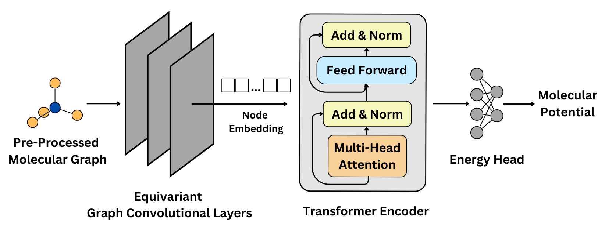

# Molecular Potential Prediction using Pre-trained EGNN and Transformer-Encoder

<br>
This repository holds an Equivariant Graph Neural Network (EGNN) + Transformer-Encoder model used for end-to-end ANI-1 molecular potential prediction. Instructions for training and evaluation of the model could be found below.

The goal of this project is to achieve accurate molecular potential prediction for the ANI-1 data set.  The model presented in this repository use a Pre-trained<sup><a href="#reference">3</a></sup> E(n) equivariant neural network<sup><a href="#reference">1</a></sup>, which becomes invariant in our case when dealing with objects with static positions, as well as an transformer encoder to capture both the local and global interactions between the point clouds to achieve molecular properties predictions accurately.

<b><i>The complete process and workflow of data-processing, model architecture creation, model training/fine-tuning with detailed documentation could be found in main.ipynb.</b></i>

## Getting Started

1. [Complete Workflow](#work)
2. [Parameter Details](#config)
3. [Environment Setup](#setup)
4. [Model Training](#training)
5. [Model Evaluation](#eval)

### Model Training and Evaluation Workflow:<a name="work"></a>
1) <b>Data Preparation</b>: Place your dataset in the `./Data` folder. Adjust the necessary parameters in the `config.yaml` file.
1) <b>Data Reading and Splitting</b>: The model imports coordinates, atom species, and energies from the files in `./Data`. It then divides the data into training/validation/test subsets as defined in the configuration.
2) <b>Pre-Processing</b>: Additional pre-processing was executed including initial node embeddings by atom type, subtraction of self interaction energy from the total energy etc.
3) <b>Data Packaging</b>: Organize the processed data into `torch_geometric.loader.DataLoader` to create a `train_loader`, which is then ready for the training process.
4) <b>Training Setup</b>: Training function configured using parameters specified in the configuration file.
5) <b>Normalization</b>: Normalize the target data (y-values) using training dataset statistics (mean and standard deviation), and record these values.
6) <b>Logging and Output</b>: Set up a logging function, file writing, and TensorBoard writer for monitoring the training process.
7) <b>Model Training</b>: Train the model batch-wise and save the model parameters with the lowest validation loss. For evaluation, the y-values are denormalized using the previously recorded standard deviation and mean.
8) <b>Evaluation on Test Set</b>: Use the best-performing model to evaluate the test set and analyze the results.

### Parameter Details<a name="config"></a>
```
    gpu: cuda:0             # Custom name for gpu device
    lr: 2e-4                # Maximum learning rate
    min_lr: 1e-7            # Minimum learning rate
    weight_decay: 0.0       # Weight decay param
    epochs: 20              # Epochs
    warmup_epochs: 0.1      # Ratio of warm up epochs
    patience_epochs: 0.9    # Ratio of pateince epochs
    log_every_n_steps: 250  # Frequency of logging

    # Load_model: None 
    load_model: models/pretrained_egnn.pth
    
    # EGNN/EGCL Parameters
    hidden_channels: 256    # Number of hidden_channels
    num_edge_feats: 0       # Number of additional edge features
    num_egcl: 3             # Number of EGCL layers
    act_fn: SiLU            # Activation function
    residual: True          # Residual calculation
    attention: True         # Graph Attention mechanism
    normalize: True         # Interatomic distance normalization
    cutoff: 5               # Interatomic distance curoff
    max_atom_type: 28       # Max atom types
    max_num_neighbors: 32   # Max number of neighborgoods
    static_coord: True      # Specify whether to update coord or not
    freeze_egcl: True       # Whether or not to freeze weights of egcls

    # Transformer-Encoder Parameters
    d_model: 256            # Embeddings for each token
    num_encoder: 1          # Number of encoder units
    num_heads: 8            # Number of self-attention heads
    num_ffn: 256            # Number of neurons in the feedforward MLP
    act_fn_ecd: ReLU        # Activation function for encoder MLP
    dropout_r: 0.1          # Dropout rate

    # Energy Head
    num_neuron: 256         # NUmber of neurons for the final energy head

    batch_size: 256         # Batch size
    num_workers: 2          # Number of workers for data loaders
    valid_size: 0.1         # Validation set size
    test_size: 0.1          # Test set size
    data_dir: './Data'      # Data directory
    seed: 42                # Random seed
```

### Environment Setup<a name="setup"></a>
```
make create-env         # Create conda environment
conda activate EGTF_env # Activate conda environment
conda deactivate        # Deactivate the environment
make delete-env         # Delete the conda envrionment
```
If error was found during the installation of torch_geometric related packages, it could be due to outdated compilers. Consider updating your compiler version, for example on linux: `conda update gxx_linux-64 gcc_linux-64`.

### Training<a name="training"></a>
To train the model using custom data, place the data in the ./Data folder. Change the `config.yaml` file accordingly, and input the following into the command line:
```
conda activate EGTF_env
python3 train.py    # Run python training script
conda deactivate    # Deactivate the environment
make delete-env     # Delete the conda envrionment
```

### Evaluation<a name="eval"></a>
To evaluate the model from a specific run using custom data, place the data in the ./Data_eval folder, and input the following into the command line:
```
conda activate EGTF_env
python3 evaluate.py Runs_savio/$SPECIFIC_RUN
conda deactivate
make delete-env     # Delete the conda envrionment
```
This will load the pre-trained model architecture, parameters, and normalizer from that specific run, and perform evaluation on 10% of the Data in Data_eval.<br>

<a name="reference"></a>
## Reference/Acknowledgement:
1. V. G. Satorras et al., <i>E(n) Equivariant Graph Neural Networks.</i> [[Paper]](https://arxiv.org/abs/2102.09844) [[GitHub]](https://github.com/vgsatorras/egnn)
2. A. Vaswani et al., <i>Attention is All You Need.</i>
[[Paper]](https://arxiv.org/abs/1706.03762)
3. Y. Wang et al., <i>Denoise Pre-training on Non-equilibrium Molecules for Accurate and Transferable Neural Potentials.</i><br> [[Paper]](https://arxiv.org/abs/2303.02216) [[GitHub]](https://github.com/yuyangw/Denoise-Pretrain-ML-Potential)
4. J. S. Smith et al., <i>ANI-1: An extensible neural network potential with DFT accuracy at force field computational cost.</i><br>
[[Paper]](https://pubs.rsc.org/en/content/articlelanding/2017/sc/c6sc05720a) [[GitHub]](https://github.com/isayev/ANI1_dataset)
5. J. S. Smith et al., <i>ANI-1, A data set of 20 million calculated off-equilibrium conformations for organic molecules.</i><br>
[[Paper]](https://www.nature.com/articles/sdata2017193)